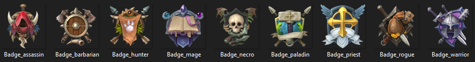
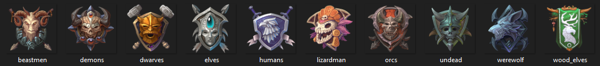
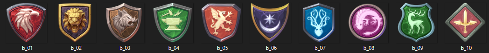
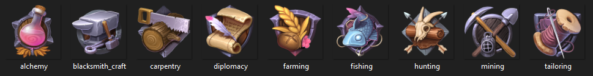
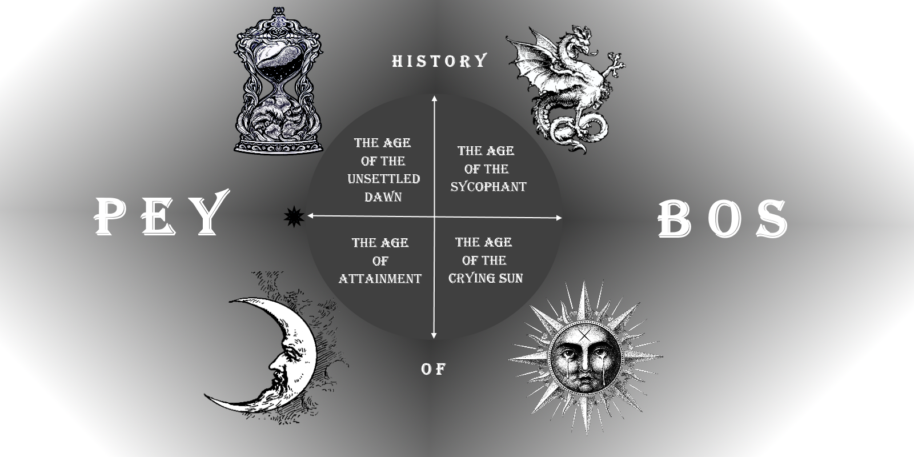

# SS RPG Game

## [Classes](Classes/ClassInfo.md)

##### [Assassin](Classes/Assassin.md):
##### [Barbarian](Classes/Barbarian.md):
##### [Hunter](Classes/Hunter.md):
##### [Necromancer](Classes/Necromancer.md):
##### [Paladin](Classes/Paladin.md):
##### [Priest](Classes/Priest.md):
##### [Rogue](Classes/Rogue.md):
##### [Warrior](Classes/Warrior.md):
---
## [Races](Races/RaceInfo.md)

##### [Beastmen](Races/Beastmen.md):
##### [Demons](Races/Demons.md):
##### [Dwarves](Races/Dwarves.md):
##### [Elves](Races/Elves.md):
##### [Humans](Races/Humans.md):
##### [Lizardmen](Races/Lizardmen.md):
##### [Orcs](Races/Orcs.md):
##### [Undead](Races/Undead.md):
##### [Werewolf](Races/Werewolf.md):
##### [Wood Elves](Races/WoodElves.md):
---
## [Alliances](Alliances/AllianceInfo.md)

##### [Scarlet Treaty (Demons & Humans)](Alliances/Scarlet_Treaty.md):
    Summary:
##### [Grayheart Concord (Dwarves & Elves & Wood Elves)](Alliances/GH_Concord.md):
    Summary:
##### [Hollowdawn (Beastmen & Lizardmen)](Alliances/Hollowdawn.md):
    Summary:
##### [Elite Voltaic (Dwarves)](Alliances/Elite_Voltaic.md):
    Summary:
##### [Alliance of Ash (Demons & Orcs)](Alliances/AoA.md):
    Summary:
##### [Drekar Hivemind (Undead)](Alliances/Drekar.md):
Summary: The reign of Vul littered the lands of Peybos with the corpses of those
unfortunate enough to enter his warpath. Vrauddeel Drekar, high spiritualist of
Grandis and self-proclaimed ferryman of the Overworld, dedicated his life to 
helping these lost beings rest. With his bones aching and his hands calloused, 
Drekar would transport the bodies of every race to De'Carres Refuge for months on 
end. There would be no rest for the man until his demise in the mausoleum he had 
created for himself and his family. This is widely considered to be the end of The 
Age of the Sychophant, and the dawn of The Age of the Crying Sun.

Not long after his death, followers of Drekar who routinely visited his mausoleum 
had began to find the rotting carcasses of the buried outside of their graves. At 
first limp and lifeless, but progressively reports of arranged and animated corpses 
flooded Peybos. Some accused Drekar's acts of benevolence to be a drawn out plan to 
resurrect himself an army. Others believed that the island, already being devoid of 
life, would not allow the dead to rest in its ashen soil. The undead continued to 
rise and organize in an unfathomable fashion which has now become known as the 
Drekar Hivemind. Vilified by most and headed by an unspecified motive, the hivemind 
assembles and awaits for its next command.

##### [Coldsong (Werewolves & Undead)](Alliances/Coldsong.md):
    Summary:
##### [Vosk Resistance (Orcs & Lizardmen)](Alliances/Vosk.md):
    Summary:
##### [Secret of the Unseen (Wood Elves & Beastmen)](Alliances/Secret_Unseen.md):
    Summary: 
##### [The Hallowed Dynasty (Werewolves & Humans & Elves)](Alliances/Hallowed_Dynasty.md):
    Summary:
---
## [Skills](Skills/SkillsInfo.md)

##### [Alchemy](Skills/Alchemy.md): 
##### [Blacksmithing](Skills/Blacksmithing.md): 
##### [Carpentry](Skills/Carpentry.md): 
##### [Diplomacy](Skills/Diplomacy.md): 
##### [Farming](Skills/Farming.md): 
##### [Fishing](Skills/Fishing.md): 
##### [Hunting](Skills/Hunting.md): 
##### [Mining](Skills/Mining.md): 
##### [Tailoring](Skills/Tailoring.md): 
---
## Game Playstyle
    [Description here]
---
## Perspective
    Either 3rd person w/
---
## Game Style
    Sandbox RPG
---
## World Setting
### [4 Ages](Ages/AgeInfo.md)
- [The Age of the Unsettled Dawn](Ages/UnsettledDawn.md)
- [The Age of the Sycophant](Ages/Sycophant.md)
- [The Age of the Crying Sun](Ages/CryingSun.md)
    * Sound of war and death undone
    * Though the stretch cannot be outrun
    * The cloth of life can now be spun
    * And bathe in the light of the crying sun
- [The Age of Attainment](Ages/Attainment.md)

